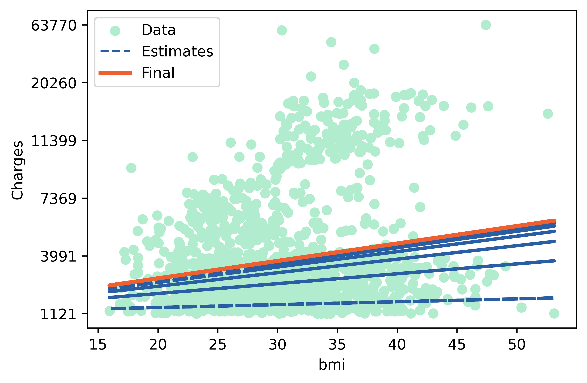

## Description
This repository contains a simple implementation of a Linear Regression model to predict the medical costs based on an individual's BMI, using Python 3.12 and TensorFlow v2.16. The project serves as a practice exercise for implementing machine learning algorithms.

## Linear Regression

Linear regression is a basic method to approximate the relationship between variables. A simple linear regression has a dependent variable (what we're trying to predict) and one or more independent variables (factors influencing the dependent variable). It's like finding a straight line that best fits the data points, helping us understand how changes in the independent variables relate to changes in the dependent variable.

In the linear regression equation ($Y = a X + b$), \(Y\) represents the dependent variable, \(X\) is the independent variable, and \(a\) and \(b\) are parameters we adjust. \(a\) is commonly referred to as the "slope" or "gradient," while \(b\) is the "intercept." This equation can be interpreted as \(Y\) being a function of \(X\), or more simply, \(Y\) depends on \(X\).

## Requirements
The code is implemented in Python 3.12 Below are the non-standard libraries and their corresponding versions used in writing the code:
<pre>
matplotlib==3.8.3
numpy==1.26.4
pandas==2.2.1
scikit_learn==1.4.1.post1
tensorflow==2.16.1
</pre>

## Usage
1. Download the Medical Cost Personal Dataset from [here](https://www.kaggle.com/datasets/mirichoi0218/insurance).
2. Extract the zip file and move the `insurance.csv` to the root directory.
3. Run the code.

## Results
When you plot the linear regression model, it appears as a straight line. Adjusting the slope parameter changes the angle between this line and the independent variable axis while adjusting the intercept parameter shifts where the line crosses the dependent variable's axis.

The following plot demonstrates how the coefficient and intercept of the line have changed to fit the data. The green dots are the data points, the blue lines are changes based on the a and b coefficients during training, and the orange line is the final line predicted by the model that shows the relationship between the dependent (Charges) and independent (BMI) variables.

  

